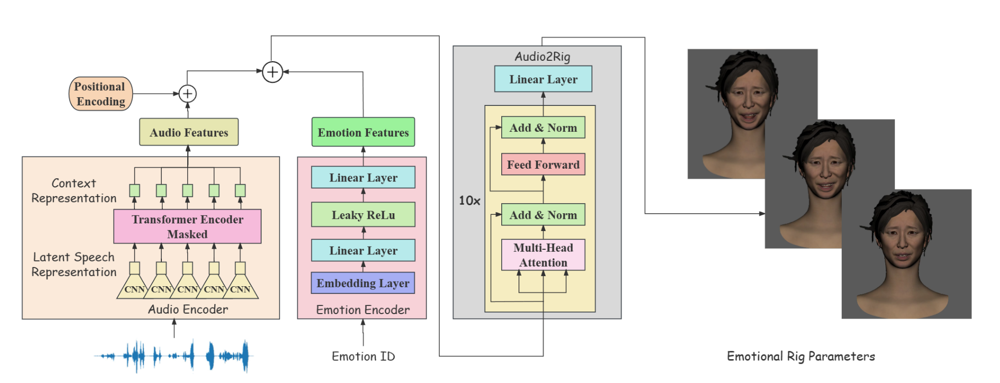

# 2025CCF-网易雷火联合基金课题数据库

回收课题相关数据，请注意文件中的readme和各目录要求：

code：存放项目源代码，按功能或模块组织，需安装依赖确保运行。

demo：提供样例数据和示例结果，含演示脚本与配置，可以速览项目功能。

model：存放训练好的模型文件，使用时要确保正确加载。

readme：即当前目录，项目文档说明，如运行指南、使用手册，使用前建议详读。

### 1. 环境配置

首先，创建虚拟环境

```bash
# 使用conda创建环境
conda create -n Retarget python=3.10
conda activate Retarget
```

通过以下命令检查您当前的CUDA版本：

```bash
nvcc -V # example versions: 11.1, 11.8, 12.1, etc.
```

然后，安装相应版本的torch。以下是不同CUDA版本的示例。如果您的CUDA版本未列出，请访问[PyTorch官方网站](https://pytorch.org/get-started/previous-versions)获取安装命令：

```bash
# for CUDA 11.1
pip install torch==1.10.1+cu111 torchvision==0.11.2 torchaudio==0.10.1 -f https://download.pytorch.org/whl/cu111/torch_stable.html
# for CUDA 11.8
pip install torch==2.3.0 torchvision==0.18.0 torchaudio==2.3.0 --index-url https://download.pytorch.org/whl/cu118
# for CUDA 12.1
pip install torch==2.3.0 torchvision==0.18.0 torchaudio==2.3.0 --index-url https://download.pytorch.org/whl/cu121
```

最后，安装其余依赖项：

```bash
pip install -r requirements.txt
```


### 2. 下载预训练模型

（1）下载LivePortrait预训练模型

从[Google Drive](https://drive.google.com/drive/folders/1UtKgzKjFAOmZkhNK-OYT0caJ_w2XAnib)中下载预训练模型并放于**Code/LivePortrait/pretrained_weights**文件夹中

（2）下载口型预测预训练模型

从[Google Drive](https://drive.google.com/file/d/1PYIfppWAIVFuO2dWQgIuLrvSMkAYYTE5/view)下载模型并放于**Model**文件夹中


### 3. 运行

（1） 进行换脸

```python
cd code/LivePortrait
python inference.py
```

（2） 对换脸的结果预测MetaHuman Rig

```python
cd ..
python test.py
```

（3） 对部分样本修正口型

```python
python pred_mouth.py
```

（4） 综合换脸的预测结果和修正口型后的结果，并在maya/UE5中渲染结果，保存在“data/render_final”中

（5） 拼接原始视频和渲染的预测结果

```4
python concat_videos.py
```


### 4. 技术方案

在本项目中，尝试了两套技术路线进行面部表情的迁移，并分别进行了实验，在图像迁移的基础上，基于音频对迁移表情中的口型进行修正。

#### 4.1 基于人脸3D重建的表情迁移

由于MetaHuman本身不支持自监督的学习，并且在方案一中已经证明了通过监督学习得到图像->MetaHuman Rig映射的可行性不高，下面考虑通过自监督的方法重建面部，再将格式转换到MetaHuman Rig上。该方案主要包含两部分，人脸的3D重建和格式转换。

使用基于FLAME模型的3D重建方案，SMIRK，作为表情迁移的基础。[SMIRK](https://openaccess.thecvf.com/content/CVPR2024/papers/Retsinas_3D_Facial_Expressions_through_Analysis-by-Neural-Synthesis_CVPR_2024_paper.pdf)和此前常见的3D重建方法EMOCA/MICA/DECA较为接近，都是以一张单目人脸图像为输入，使用一个映射网络预测对应的FLAME参数，包括pose，expression，shape，jaw等，再使用可微渲染的FLAME 2020模型去监督预测过程。重建结果基于FLAME，输出为100维的shape，50维的expression和3维的jaw。在获得面部重建的结果后，尝试需要将对应的FLAME参数转换为MetaHuman Rig的格式。使用和UE5的MetaHuman相兼容的ARKit52格式作为中间格式进行转换，ARKit52可以通过Live Link在UE5内解算为MetaHuman Rig的形式。

（1） ARKi52->MetaHuman

以LiveLink离线导入类似的模式，通过一个带时间戳的csv文件将ARKit52格式的表情导入UE5的MetaHuman，并解算为MetaHuman Rig。通过收集对应的数据对，拟合二者之间的映射关系。

（2） FLAME->ARKit52

由于缺乏公开的ARKit52头模，使用[EmoTalk](https://github.com/psyai-net/EmoTalk_release)渲染所用的ARKit52头模和FLAME的标准头模作为转换的素材。首先由于两个头模的顶点数和拓扑结构不统一，对ARKit52的blendshape以FLAME的标准拓扑自动蒙皮，统一二者的顶点拓扑。另外，ARKit52头模的基本形态和FLAME模型不同，保持FLAME的expression和jaw参数为0，调整shape以尽可能与ARKit52的basis模型统一，保存shape参数用于后续的拟合。最后，根据每一个blendshape相对于basis头模的顶点偏移，对于任意一个FLAME的expression或jaw参数到ARKit52的映射，设置shape为此前拟合的结果，可以通过最优化ARKit52参数的方式，以顶点位置差异作为监督实现FLAME->ARKit52的映射。

在分别得到3D重建的FLAME结果，以及FLAME->ARKit52，ARKit52->MetaHuman Rig的映射关系后，即可实现图像->MetaHuman的预测。但是在实验过程中，受限于ARKit52头模的质量和3D面部控制方式之间表达范围的不同，质量并不理想。

####  4.2  基于换脸的2D转3D方案

受制于现有的多角色的视频-MetaHuman Rig控制器数据集的缺失，考虑将所有角色的表情通过一个已有模型转换到同一角色上，以提高预测的鲁棒性。该方案主要包含两部分，2D视频换脸和根据人脸图像预测MetaHuman Rig。

由于没有提供对应的视频-rig训练数据，并且由于格式为MetaHuman，因此不能进行自监督学习，只能进行监督学习。如果直接从原视频映射到MetaHuman rig，由于角色的来源很广，因此稳定性会存在一定的问题。所以使用MetaHuman Animator录制的视频-MetaHuman Rig进行网络的训练，但将其中的人脸都换脸到同一个角色上。

换脸基于LivePortrait，以图像或者视频作为driving，一个neutral的面部作为source，即可得到换脸的结果。由于基于视频的换脸要求视频的第一帧为中性表情，并且不能有过于剧烈的面部位置变动，直接使用视频进行换脸的结果不理想。因此，使用基于视频帧的图像换脸，对于潜在的视频稳定性问题，对映射的结果采用滤波器进行平滑处理。

训练数据的录制基于UE5的MetaHuman Animator，录制涵盖面部各部分动作和说话的视频，并通过UE5解算为对应的MetaHuman Rig。同样对训练数据换脸到同一个角色面部，通过ResNet50+conv2d的映射模型预测对应的面部控制器参数。

<p align="center">
  
</p>

####  4.3 基于音频的口型修正

在前两个方案的基础上，对于一些口型与音频匹配度强相关的样本，使用音频输入，根据音频特征预测对应的MetaHuman Rig，并修正此前预测结果中的口型部分。

使用了基于wav2vec2.0的多情绪口型预测模型[EmoFace](https://github.com/SJTU-Lucy/EmoFace)。该模型使用wav2vec2.0作为音频编码器，结合emotion embedding后通过transformer encoder layer预测对应的表情参数，最后通过后处理增加眼动和眨眼的信息以提高真实性。由于只需要修正口型，因此将emotion设置为neutral，并忽略后处理的过程。

不是所有样本都适合进行口型修正，进行样本的选取，提取对应的音频，并使用EmoFace进行面部表情的预测，替代此前预测参数中的口型部分。

<p align="center">
  
</p>
